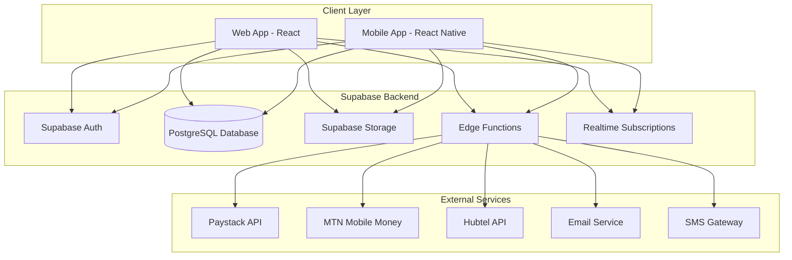
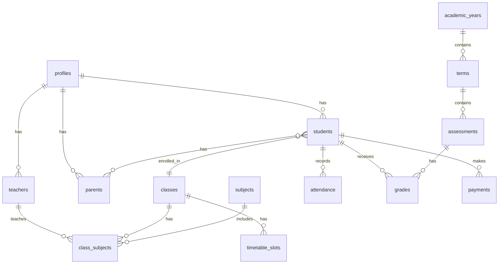

# Design Document

## Overview

The SAR Educational Complex School Management System is a full-stack, cloud-native application built with React (web), React Native (mobile), and Supabase as the backend-as-a-service platform. The system follows a modern three-tier architecture with a responsive web frontend, native mobile applications, and a centralized Supabase backend providing database, authentication, storage, and serverless functions.

The design emphasizes:
- Role-based access control with four distinct user types
- Real-time data synchronization across platforms
- Scalable cloud infrastructure
- Secure payment processing with multiple Ghanaian payment gateways
- Automated notifications and reporting
- Offline-capable mobile applications

## Architecture

### High-Level Architecture



### Technology Stack

**Frontend (Web)**
- React 18+ with TypeScript
- Tailwind CSS for styling
- React Router for navigation
- React Query for data fetching and caching
- Supabase JS Client for backend integration
- Recharts for analytics visualization
- jsPDF for PDF generation

**Mobile**
- React Native with TypeScript
- React Navigation for routing
- React Native Paper for UI components
- Supabase JS Client
- AsyncStorage for offline data
- React Native Chart Kit for visualizations
- React Native PDF for document generation

**Backend**
- Supabase PostgreSQL database
- Supabase Authentication (JWT-based)
- Supabase Storage for file management
- Supabase Edge Functions (Deno runtime) for serverless logic
- Row Level Security (RLS) policies for data access control

**Deployment**
- Web: Vercel or Netlify
- Mobile: Android APK (direct download), iOS App Store
- Backend: Supabase Cloud (free tier initially)

## Components and Interfaces

### 1. Authentication Module

**Components:**
- `LoginScreen`: Universal login interface for all user roles
- `AuthProvider`: Context provider managing authentication state
- `ProtectedRoute`: Route wrapper enforcing authentication
- `RoleGuard`: Component enforcing role-based access

**Supabase Integration:**
```typescript
// Authentication flow
interface AuthService {
  signIn(email: string, password: string): Promise<User>
  signOut(): Promise<void>
  getCurrentUser(): User | null
  getUserRole(): UserRole
}

type UserRole = 'admin' | 'teacher' | 'student' | 'parent'

interface User {
  id: string
  email: string
  role: UserRole
  profile_id: string
}
```

**Implementation:**
- Use Supabase Auth with email/password provider
- Store user role in `profiles` table with foreign key to `auth.users`
- Implement custom claims or metadata for role identification
- Use RLS policies to restrict data access based on user role

### 2. Admin Dashboard Module

**Components:**
- `AdminDashboard`: Main admin interface with statistics overview
- `UserManagement`: CRUD interface for teachers, students, parents
- `ClassManagement`: Interface for creating and managing classes
- `SubjectManagement`: Interface for subject and teacher assignments
- `TimetableBuilder`: Drag-and-drop timetable creation interface
- `TermCalendar`: Academic calendar management
- `FeeManagement`: Payment recording and tracking interface
- `AnnouncementCreator`: Rich text editor for announcements
- `DocumentUploader`: File upload interface with preview

**Key Features:**
- Dashboard widgets showing: total students, total teachers, fee collection rate, attendance rate
- Bulk import functionality for student/teacher data (CSV upload)
- Visual timetable builder with conflict detection
- Payment history with filtering and export capabilities

### 3. Teacher Portal Module

**Components:**
- `TeacherDashboard`: Overview of assigned classes and upcoming sessions
- `AttendanceMarker`: Class roster with attendance marking interface
- `GradeBook`: Assessment recording and grade calculation interface
- `MaterialUploader`: Interface for uploading notes and assignments
- `MessagingInterface`: Communication panel for students and parents
- `ClassList`: View of assigned students with performance summaries

**Key Features:**
- Quick attendance marking with swipe gestures (mobile)
- Grade entry with automatic calculation of averages
- Batch upload of materials to multiple classes
- Template messages for common communications

### 4. Student Portal Module

**Components:**
- `StudentDashboard`: Personalized overview of academic status
- `TimetableView`: Weekly schedule display
- `ResultsView`: Grades and assessment history
- `AttendanceHistory`: Attendance records with statistics
- `AssignmentList`: Upcoming and past assignments
- `MaterialLibrary`: Access to uploaded teaching materials
- `AnnouncementFeed`: School and class announcements

**Key Features:**
- Color-coded timetable with current class highlighting
- Performance charts showing grade trends
- Download functionality for materials (offline access on mobile)
- Push notifications for new assignments and results

### 5. Parent Portal Module

**Components:**
- `ParentDashboard`: Overview of child's academic status
- `ChildSelector`: Dropdown for parents with multiple children
- `PerformanceView`: Detailed grade reports and analytics
- `AttendanceMonitor`: Attendance tracking with alerts
- `FeeStatus`: Payment history and outstanding balance
- `NotificationCenter`: All communications and alerts
- `ReportCardViewer`: Access to generated report cards

**Key Features:**
- Multi-child support with profile switching
- Performance comparison across terms
- Payment reminders with quick pay links
- Direct messaging with teachers

### 6. Payment Processing Module

**Components:**
- `PaymentForm`: Interface for initiating payments
- `PaymentHistory`: Transaction records and receipts
- `InvoiceGenerator`: Automated invoice creation
- `ReceiptViewer`: Digital receipt display and download

**Supabase Edge Functions:**
```typescript
// Payment processing functions
interface PaymentFunctions {
  initiatePaystackPayment(amount: number, studentId: string): Promise<PaymentUrl>
  verifyPaystackPayment(reference: string): Promise<PaymentStatus>
  initiateMomoPayment(phone: string, amount: number): Promise<TransactionId>
  verifyMomoPayment(transactionId: string): Promise<PaymentStatus>
  recordManualPayment(payment: ManualPayment): Promise<Receipt>
}
```

**Implementation:**
- Edge Functions handle payment gateway API calls
- Webhook endpoints for payment confirmations
- Automatic receipt generation and email delivery
- Payment status tracking with retry logic for failed transactions

### 7. Reports and Analytics Module

**Components:**
- `ReportCardGenerator`: Automated report card creation
- `PerformanceCharts`: Visual analytics dashboard
- `AttendanceReports`: Attendance statistics and trends
- `FinancialReports`: Fee collection and outstanding balance reports
- `ExportManager`: PDF and CSV export functionality

**Report Card Generation:**
```typescript
interface ReportCard {
  studentId: string
  term: string
  academicYear: string
  subjects: SubjectGrade[]
  attendance: AttendanceStats
  remarks: string
  position: number
  totalStudents: number
}

interface SubjectGrade {
  subject: string
  classScore: number
  examScore: number
  totalScore: number
  grade: string
  remarks: string
}
```

**Implementation:**
- Use jsPDF (web) and React Native PDF (mobile) for generation
- Template-based design with school branding
- Automatic grade calculation and ranking
- Batch generation for entire classes

### 8. Notification System

**Components:**
- `NotificationService`: Centralized notification dispatcher
- `NotificationList`: User notification inbox
- `NotificationPreferences`: User settings for notification types

**Supabase Edge Functions:**
```typescript
interface NotificationFunctions {
  sendEmailNotification(to: string, subject: string, body: string): Promise<void>
  sendSMSNotification(phone: string, message: string): Promise<void>
  sendPushNotification(userId: string, notification: PushPayload): Promise<void>
  scheduleReminder(type: ReminderType, scheduledFor: Date): Promise<void>
}
```

**Implementation:**
- Database triggers for automatic notifications (new grades, announcements)
- Scheduled Edge Functions for fee reminders (cron jobs)
- In-app notification storage in `notifications` table
- Email integration using Supabase's built-in email or SendGrid
- SMS integration using Hubtel or Twilio for Ghana

### 9. File Storage Module

**Components:**
- `FileUploader`: Drag-and-drop file upload interface
- `FileManager`: Browse and manage uploaded files
- `FileViewer`: Preview documents and images

**Supabase Storage Structure:**
```
sar-school-storage/
├── documents/
│   ├── policies/
│   ├── forms/
│   └── circulars/
├── materials/
│   ├── {subject_id}/
│   │   ├── notes/
│   │   └── assignments/
├── reports/
│   └── {student_id}/
│       └── {term}/
└── profile-images/
    ├── students/
    ├── teachers/
    └── staff/
```

**Implementation:**
- Bucket-level access policies based on user roles
- File size limits: 10MB for documents, 5MB for images
- Automatic thumbnail generation for images
- Virus scanning for uploaded files (using Edge Functions)

## Data Models

### Database Schema

```sql
-- Users and Profiles
CREATE TABLE profiles (
  id UUID PRIMARY KEY REFERENCES auth.users(id),
  email TEXT UNIQUE NOT NULL,
  role TEXT NOT NULL CHECK (role IN ('admin', 'teacher', 'student', 'parent')),
  first_name TEXT NOT NULL,
  last_name TEXT NOT NULL,
  phone TEXT,
  address TEXT,
  profile_image_url TEXT,
  created_at TIMESTAMPTZ DEFAULT NOW(),
  updated_at TIMESTAMPTZ DEFAULT NOW()
);

-- Academic Structure
CREATE TABLE academic_years (
  id UUID PRIMARY KEY DEFAULT uuid_generate_v4(),
  year_name TEXT NOT NULL,
  start_date DATE NOT NULL,
  end_date DATE NOT NULL,
  is_current BOOLEAN DEFAULT FALSE,
  created_at TIMESTAMPTZ DEFAULT NOW()
);

CREATE TABLE terms (
  id UUID PRIMARY KEY DEFAULT uuid_generate_v4(),
  academic_year_id UUID REFERENCES academic_years(id) ON DELETE CASCADE,
  term_name TEXT NOT NULL,
  term_number INTEGER NOT NULL CHECK (term_number IN (1, 2, 3)),
  start_date DATE NOT NULL,
  end_date DATE NOT NULL,
  is_current BOOLEAN DEFAULT FALSE,
  created_at TIMESTAMPTZ DEFAULT NOW()
);

CREATE TABLE classes (
  id UUID PRIMARY KEY DEFAULT uuid_generate_v4(),
  class_name TEXT NOT NULL,
  level TEXT NOT NULL CHECK (level IN ('Creche', 'Nursery', 'KG', 'Primary', 'JHS')),
  grade_number INTEGER,
  capacity INTEGER,
  created_at TIMESTAMPTZ DEFAULT NOW()
);

CREATE TABLE subjects (
  id UUID PRIMARY KEY DEFAULT uuid_generate_v4(),
  subject_name TEXT NOT NULL,
  subject_code TEXT UNIQUE,
  description TEXT,
  created_at TIMESTAMPTZ DEFAULT NOW()
);

-- Students
CREATE TABLE students (
  id UUID PRIMARY KEY DEFAULT uuid_generate_v4(),
  profile_id UUID REFERENCES profiles(id) ON DELETE CASCADE,
  student_id TEXT UNIQUE NOT NULL,
  class_id UUID REFERENCES classes(id),
  date_of_birth DATE,
  gender TEXT CHECK (gender IN ('Male', 'Female')),
  admission_date DATE NOT NULL,
  status TEXT DEFAULT 'active' CHECK (status IN ('active', 'inactive', 'graduated')),
  created_at TIMESTAMPTZ DEFAULT NOW(),
  updated_at TIMESTAMPTZ DEFAULT NOW()
);

-- Teachers
CREATE TABLE teachers (
  id UUID PRIMARY KEY DEFAULT uuid_generate_v4(),
  profile_id UUID REFERENCES profiles(id) ON DELETE CASCADE,
  teacher_id TEXT UNIQUE NOT NULL,
  qualification TEXT,
  specialization TEXT,
  hire_date DATE NOT NULL,
  status TEXT DEFAULT 'active' CHECK (status IN ('active', 'inactive')),
  created_at TIMESTAMPTZ DEFAULT NOW(),
  updated_at TIMESTAMPTZ DEFAULT NOW()
);

-- Parents
CREATE TABLE parents (
  id UUID PRIMARY KEY DEFAULT uuid_generate_v4(),
  profile_id UUID REFERENCES profiles(id) ON DELETE CASCADE,
  occupation TEXT,
  created_at TIMESTAMPTZ DEFAULT NOW()
);

CREATE TABLE student_parents (
  id UUID PRIMARY KEY DEFAULT uuid_generate_v4(),
  student_id UUID REFERENCES students(id) ON DELETE CASCADE,
  parent_id UUID REFERENCES parents(id) ON DELETE CASCADE,
  relationship TEXT NOT NULL CHECK (relationship IN ('Father', 'Mother', 'Guardian')),
  is_primary BOOLEAN DEFAULT FALSE,
  created_at TIMESTAMPTZ DEFAULT NOW(),
  UNIQUE(student_id, parent_id)
);

-- Class and Subject Assignments
CREATE TABLE class_subjects (
  id UUID PRIMARY KEY DEFAULT uuid_generate_v4(),
  class_id UUID REFERENCES classes(id) ON DELETE CASCADE,
  subject_id UUID REFERENCES subjects(id) ON DELETE CASCADE,
  teacher_id UUID REFERENCES teachers(id),
  academic_year_id UUID REFERENCES academic_years(id),
  created_at TIMESTAMPTZ DEFAULT NOW(),
  UNIQUE(class_id, subject_id, academic_year_id)
);

-- Timetable
CREATE TABLE timetable_slots (
  id UUID PRIMARY KEY DEFAULT uuid_generate_v4(),
  class_id UUID REFERENCES classes(id) ON DELETE CASCADE,
  subject_id UUID REFERENCES subjects(id),
  teacher_id UUID REFERENCES teachers(id),
  term_id UUID REFERENCES terms(id),
  day_of_week INTEGER NOT NULL CHECK (day_of_week BETWEEN 1 AND 5),
  start_time TIME NOT NULL,
  end_time TIME NOT NULL,
  created_at TIMESTAMPTZ DEFAULT NOW()
);

-- Attendance
CREATE TABLE attendance (
  id UUID PRIMARY KEY DEFAULT uuid_generate_v4(),
  student_id UUID REFERENCES students(id) ON DELETE CASCADE,
  class_id UUID REFERENCES classes(id),
  date DATE NOT NULL,
  status TEXT NOT NULL CHECK (status IN ('present', 'absent', 'late')),
  marked_by UUID REFERENCES teachers(id),
  remarks TEXT,
  created_at TIMESTAMPTZ DEFAULT NOW(),
  UNIQUE(student_id, date)
);

-- Assessments and Grades
CREATE TABLE assessments (
  id UUID PRIMARY KEY DEFAULT uuid_generate_v4(),
  class_id UUID REFERENCES classes(id) ON DELETE CASCADE,
  subject_id UUID REFERENCES subjects(id) ON DELETE CASCADE,
  term_id UUID REFERENCES terms(id),
  assessment_type TEXT NOT NULL CHECK (assessment_type IN ('class_work', 'homework', 'test', 'exam')),
  assessment_name TEXT NOT NULL,
  total_marks DECIMAL NOT NULL,
  date DATE NOT NULL,
  created_by UUID REFERENCES teachers(id),
  created_at TIMESTAMPTZ DEFAULT NOW()
);

CREATE TABLE grades (
  id UUID PRIMARY KEY DEFAULT uuid_generate_v4(),
  assessment_id UUID REFERENCES assessments(id) ON DELETE CASCADE,
  student_id UUID REFERENCES students(id) ON DELETE CASCADE,
  score DECIMAL NOT NULL,
  remarks TEXT,
  recorded_by UUID REFERENCES teachers(id),
  created_at TIMESTAMPTZ DEFAULT NOW(),
  updated_at TIMESTAMPTZ DEFAULT NOW(),
  UNIQUE(assessment_id, student_id)
);

-- Fees and Payments
CREATE TABLE fee_structures (
  id UUID PRIMARY KEY DEFAULT uuid_generate_v4(),
  class_id UUID REFERENCES classes(id),
  academic_year_id UUID REFERENCES academic_years(id),
  term_id UUID REFERENCES terms(id),
  fee_type TEXT NOT NULL,
  amount DECIMAL NOT NULL,
  description TEXT,
  created_at TIMESTAMPTZ DEFAULT NOW()
);

CREATE TABLE payments (
  id UUID PRIMARY KEY DEFAULT uuid_generate_v4(),
  student_id UUID REFERENCES students(id) ON DELETE CASCADE,
  amount DECIMAL NOT NULL,
  payment_date DATE NOT NULL,
  payment_method TEXT NOT NULL CHECK (payment_method IN ('cash', 'bank_transfer', 'mobile_money', 'card')),
  payment_reference TEXT UNIQUE,
  payment_gateway TEXT CHECK (payment_gateway IN ('paystack', 'mtn_momo', 'hubtel', 'manual')),
  status TEXT DEFAULT 'completed' CHECK (status IN ('pending', 'completed', 'failed', 'refunded')),
  term_id UUID REFERENCES terms(id),
  recorded_by UUID REFERENCES profiles(id),
  receipt_url TEXT,
  created_at TIMESTAMPTZ DEFAULT NOW()
);

-- Communications
CREATE TABLE announcements (
  id UUID PRIMARY KEY DEFAULT uuid_generate_v4(),
  title TEXT NOT NULL,
  content TEXT NOT NULL,
  target_audience TEXT[] NOT NULL,
  created_by UUID REFERENCES profiles(id),
  priority TEXT DEFAULT 'normal' CHECK (priority IN ('low', 'normal', 'high', 'urgent')),
  published_at TIMESTAMPTZ DEFAULT NOW(),
  expires_at TIMESTAMPTZ,
  created_at TIMESTAMPTZ DEFAULT NOW()
);

CREATE TABLE messages (
  id UUID PRIMARY KEY DEFAULT uuid_generate_v4(),
  sender_id UUID REFERENCES profiles(id),
  recipient_id UUID REFERENCES profiles(id),
  subject TEXT,
  content TEXT NOT NULL,
  is_read BOOLEAN DEFAULT FALSE,
  sent_at TIMESTAMPTZ DEFAULT NOW()
);

CREATE TABLE notifications (
  id UUID PRIMARY KEY DEFAULT uuid_generate_v4(),
  user_id UUID REFERENCES profiles(id) ON DELETE CASCADE,
  title TEXT NOT NULL,
  message TEXT NOT NULL,
  type TEXT NOT NULL CHECK (type IN ('announcement', 'grade', 'payment', 'attendance', 'message')),
  is_read BOOLEAN DEFAULT FALSE,
  action_url TEXT,
  created_at TIMESTAMPTZ DEFAULT NOW()
);

-- Materials and Documents
CREATE TABLE materials (
  id UUID PRIMARY KEY DEFAULT uuid_generate_v4(),
  subject_id UUID REFERENCES subjects(id),
  class_id UUID REFERENCES classes(id),
  title TEXT NOT NULL,
  description TEXT,
  file_url TEXT NOT NULL,
  file_type TEXT NOT NULL,
  uploaded_by UUID REFERENCES teachers(id),
  created_at TIMESTAMPTZ DEFAULT NOW()
);

-- Audit Log
CREATE TABLE audit_logs (
  id UUID PRIMARY KEY DEFAULT uuid_generate_v4(),
  user_id UUID REFERENCES profiles(id),
  action TEXT NOT NULL,
  table_name TEXT NOT NULL,
  record_id UUID,
  old_values JSONB,
  new_values JSONB,
  created_at TIMESTAMPTZ DEFAULT NOW()
);
```

### Entity Relationships



## Error Handling

### Client-Side Error Handling

**Error Categories:**
1. **Network Errors**: Connection failures, timeouts
2. **Authentication Errors**: Invalid credentials, expired sessions
3. **Validation Errors**: Invalid form inputs, business rule violations
4. **Authorization Errors**: Insufficient permissions
5. **Server Errors**: Backend failures, database errors

**Implementation Strategy:**
```typescript
// Centralized error handler
class ErrorHandler {
  handle(error: AppError): void {
    switch (error.type) {
      case 'network':
        this.showRetryDialog(error)
        break
      case 'auth':
        this.redirectToLogin()
        break
      case 'validation':
        this.showValidationErrors(error.details)
        break
      case 'authorization':
        this.showAccessDenied()
        break
      default:
        this.showGenericError(error)
    }
    
    // Log to monitoring service
    this.logError(error)
  }
}
```

**User-Friendly Messages:**
- Network errors: "Connection lost. Please check your internet and try again."
- Auth errors: "Your session has expired. Please log in again."
- Validation errors: Specific field-level messages
- Server errors: "Something went wrong. Our team has been notified."

### Server-Side Error Handling

**Supabase Edge Functions:**
```typescript
// Standard error response format
interface ErrorResponse {
  error: {
    code: string
    message: string
    details?: any
  }
}

// Error handling middleware
function handleError(error: Error): Response {
  console.error('Function error:', error)
  
  if (error instanceof ValidationError) {
    return new Response(
      JSON.stringify({
        error: {
          code: 'VALIDATION_ERROR',
          message: error.message,
          details: error.fields
        }
      }),
      { status: 400 }
    )
  }
  
  // Generic error
  return new Response(
    JSON.stringify({
      error: {
        code: 'INTERNAL_ERROR',
        message: 'An unexpected error occurred'
      }
    }),
    { status: 500 }
  )
}
```

**Database Error Handling:**
- Use try-catch blocks for all database operations
- Implement transaction rollback for multi-step operations
- Log errors to audit_logs table
- Return user-friendly messages without exposing internal details

### Offline Handling (Mobile)

**Strategy:**
- Cache frequently accessed data using AsyncStorage
- Queue write operations when offline
- Sync queued operations when connection restored
- Show offline indicator in UI
- Disable features requiring real-time data when offline

## Testing Strategy

### Unit Testing

**Web (React):**
- Jest + React Testing Library
- Test individual components in isolation
- Mock Supabase client for API calls
- Test user interactions and state changes
- Target: 70% code coverage

**Mobile (React Native):**
- Jest + React Native Testing Library
- Test components and navigation flows
- Mock AsyncStorage and Supabase client
- Test offline functionality
- Target: 70% code coverage

**Edge Functions:**
- Deno test framework
- Test business logic and API integrations
- Mock external API calls (Paystack, MTN, etc.)
- Test error handling scenarios
- Target: 80% code coverage

### Integration Testing

**API Integration:**
- Test Supabase client integration
- Test RLS policies with different user roles
- Test file upload/download flows
- Test real-time subscriptions
- Use Supabase local development environment

**Payment Integration:**
- Test payment gateway integrations in sandbox mode
- Test webhook handling
- Test payment status updates
- Test receipt generation

### End-to-End Testing

**Web:**
- Playwright or Cypress
- Test critical user flows:
  - Admin creating a student and recording payment
  - Teacher marking attendance and recording grades
  - Student viewing results
  - Parent checking fee balance and making payment
- Test across different browsers

**Mobile:**
- Detox (React Native)
- Test critical flows on iOS and Android simulators
- Test offline scenarios
- Test push notifications

### Manual Testing

**User Acceptance Testing:**
- Test with actual school staff (admin, teachers)
- Test with sample parent and student accounts
- Verify Ghana-specific features (educational levels, payment methods)
- Test on actual devices (various Android phones, iPhones)
- Verify branding and customization

**Performance Testing:**
- Load testing with expected user volumes
- Test with realistic data volumes (500+ students)
- Test file upload/download speeds
- Test report generation performance
- Monitor Supabase database performance

### Security Testing

**Authentication & Authorization:**
- Test RLS policies prevent unauthorized access
- Test session management and token expiration
- Test role-based access controls
- Attempt SQL injection and XSS attacks

**Data Protection:**
- Verify sensitive data encryption
- Test file access permissions
- Verify payment data security
- Test API endpoint security

## Deployment Strategy

### Development Environment

**Local Setup:**
- Supabase CLI for local development
- Environment variables for API keys
- Mock payment gateways for testing
- Local database seeding with sample data

### Staging Environment

**Supabase Project:**
- Separate Supabase project for staging
- Copy of production database schema
- Test data for UAT
- Staging payment gateway credentials

**Web Deployment:**
- Deploy to Vercel preview environment
- Automatic deployment on PR creation
- Environment-specific configuration

### Production Environment

**Supabase Setup:**
- Production Supabase project
- Enable database backups (daily)
- Configure RLS policies
- Set up monitoring and alerts
- Enable Supabase Realtime

**Web Deployment (Vercel):**
```bash
# Build configuration
Build Command: npm run build
Output Directory: dist
Environment Variables:
  - VITE_SUPABASE_URL
  - VITE_SUPABASE_ANON_KEY
  - VITE_PAYSTACK_PUBLIC_KEY
```

**Mobile Deployment:**

*Android:*
- Build APK using EAS Build or React Native CLI
- Sign with release keystore
- Host APK on school website for download
- Optional: Publish to Google Play Store

*iOS:*
- Build IPA using EAS Build or Xcode
- Sign with Apple Developer certificate
- Publish to App Store
- Requires Apple Developer account ($99/year)

### Monitoring and Maintenance

**Application Monitoring:**
- Supabase Dashboard for database metrics
- Vercel Analytics for web traffic
- Error tracking with Sentry or similar
- Performance monitoring

**Database Maintenance:**
- Regular backups (automated daily)
- Periodic data cleanup (old notifications, logs)
- Index optimization for query performance
- Monitor storage usage

**Security Updates:**
- Regular dependency updates
- Security patch monitoring
- SSL certificate renewal (automatic with Vercel)
- API key rotation schedule

## Performance Optimization

### Frontend Optimization

**Web:**
- Code splitting with React.lazy()
- Image optimization and lazy loading
- Caching with React Query
- Minimize bundle size
- Use production builds

**Mobile:**
- Optimize images for mobile
- Implement pagination for large lists
- Use FlatList for efficient rendering
- Cache data locally
- Minimize re-renders

### Backend Optimization

**Database:**
- Create indexes on frequently queried columns
- Use database views for complex queries
- Implement pagination for large result sets
- Optimize RLS policies
- Use connection pooling

**Edge Functions:**
- Minimize cold start times
- Cache external API responses
- Use batch operations where possible
- Implement request throttling

### Caching Strategy

**Client-Side:**
- Cache user profile data
- Cache static data (classes, subjects)
- Cache recently viewed data
- Implement stale-while-revalidate pattern

**Server-Side:**
- Cache computed reports
- Cache aggregated statistics
- Use Supabase Realtime for live updates
- Implement CDN for static assets
